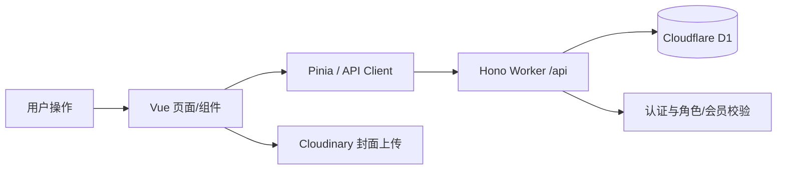

# 1. 项目是什么

项目名为“游浪游戏资源发布网站”（包名 `youlun-game-resource`），是面向 PC 游戏资源浏览与下载的响应式网站。用户可以搜索、分类/标签筛选游戏，注册登录后获取免费资源，会员可访问会员资源；还支持会员付款工单、问题反馈、密码修改和历史记录。管理员后台可维护游戏、下载链接、分类标签、用户权限、会员工单和反馈。当前前后端、D1 数据库、权限校验及桌面/手机版均已实现，采用单个 Cloudflare Worker 统一部署。

# 2. 技术栈

- Vue 3、TypeScript、Vite：前端 SPA 与构建。
- Vue Router、Pinia：路由权限和登录会话状态。
- Element Plus、Lucide Vue：表单、弹窗、分页和图标。
- Hono、Zod：Cloudflare Worker API、路由和输入校验。
- Cloudflare Workers、D1、Wrangler：运行时、SQLite 数据库、迁移和部署。
- Cloudinary：管理员浏览器端无签名上传游戏封面。
- Playwright：Edge 桌面和手机视口端到端测试。

# 3. 核心目录

- `src/`：Vue 前端；`views/` 是页面，`components/` 是共享组件，`api/` 是请求层，`stores/` 是状态管理。
- `worker/src/`：Hono 后端、认证、管理员 API 和 Worker 类型。
- `worker/migrations/`：D1 数据库结构迁移；`worker/seeds/` 仅用于本地开发数据。
- `public/assets/`：品牌图、首页背景和付款码等静态资源。
- `tests/e2e/`：核心用户流程和响应式冒烟测试。

# 4. 核心文件

- `src/router/index.ts`：全部页面路由及登录/管理员守卫；新增页面或改访问权限先看这里。
- `src/api/client.ts`：前端所有 API 类型与调用入口；接口契约变化需同步修改。
- `src/stores/auth.ts`：会话恢复、登录、注册、退出及会员/管理员派生状态。
- `src/views/HomeView.vue`、`GamesView.vue`、`ProfileView.vue`：首页轮播、游戏分页筛选、个人中心与会员工单的主要实现。
- `src/views/AdminView.vue`：完整管理后台；游戏最低配置在界面中使用固定字段，保存时仍序列化为字符串数组。
- `src/styles.css`：全站样式、动画和所有响应式规则，调整手机布局应先检查对应媒体查询。
- `worker/src/index.ts`：公开 API、认证入口、反馈、会员工单、下载权限和全局中间件。
- `worker/src/admin.ts`：管理员专用 API；涉及后台 CRUD、审核或用户权限时优先查看。
- `worker/src/auth.ts`：PBKDF2 密码哈希、HttpOnly Cookie、会话读取与会员有效期计算。
- `wrangler.toml`：生产 Worker、静态资源、D1 绑定、允许来源和日志配置。

# 5. 数据 / API

业务数据存于 Cloudflare D1。完整表结构在 `worker/migrations/0001_initial.sql`，登录限流表在 `0002_auth_attempts.sql`；主要表包括用户、会话、游戏、下载链接、分类、标签、反馈和会员工单。API 均位于 `/api`，由 `worker/src/index.ts` 和 `admin.ts` 提供；前端通过 `src/api/client.ts` 使用 Cookie 同域通信。公开游戏接口不会返回真实下载 URL，下载地址只能通过鉴权接口取得。

重要配置包括 Worker 的 `DB`、`ASSETS`、`APP_ENV`、`ALLOWED_ORIGIN`，以及前端可选的 `VITE_API_BASE_URL`、`VITE_SUPPORT_EMAIL`。不得在文档或代码中记录真实密钥。

# 6. 功能之间的关系



路由守卫先调用会话恢复；Worker 从 Cookie 查询会话并把用户放入请求上下文。游戏列表经 API 分页（桌面 20、手机 8，后端上限 20）。下载、反馈、工单要求登录，会员下载和 `/admin/*` 还会进行服务端权限校验。

# 7. 怎么运行

```bash
npm install
npm run db:migrate:local
npm run db:seed:local
npm run dev:api
npm run dev
```

API 默认是 `127.0.0.1:8787`，Vite 是 `127.0.0.1:5173`。检查与发布命令：

```bash
npm run typecheck
npm run typecheck:api
npm run test:e2e
npm run build
npm run db:migrate:remote
npm run deploy
```

# 8. 修改时注意什么

- 页面内容先改对应 `views/*.vue`；共享导航/卡片看 `components/`，全局和移动端表现看 `styles.css`。
- API 字段变化必须同步后端路由、`src/api/client.ts` 和使用该数据的页面；数据库变化必须新增迁移，不要直接改已执行的迁移。
- 不要把下载 URL 放入公开游戏响应，也不要只依赖前端判断会员或管理员权限。
- 认证使用 PBKDF2、哈希会话令牌和 HttpOnly Cookie；当前迭代次数兼顾 Worker CPU 限制，不要随意提高或改成不兼容算法。
- 首页背景会随机开始、预加载后线性缩放并交叉淡入；修改时要保持无灰屏并兼容 `prefers-reduced-motion`。
- 管理后台最低配置固定字段最终仍保存为 `minConfig: string[]`，不要误改为新数据库对象结构。
- `wrangler.toml` 中 Worker 名称、D1 ID、资源绑定、生产来源和 SPA 静态资源策略相互关联，不要随意替换。生产库不要重复执行开发 seed。
- 修改后至少运行类型检查和构建；涉及页面流程、路由、认证或响应式布局时运行 `npm run test:e2e`。

# AI 快速上手

这是一个 Vue 3 + TypeScript 前端、Hono + Cloudflare Workers 后端、D1 数据库组成的 PC 游戏资源网站，前端静态资源和 `/api` 由同一 Worker 托管。页面在 `src/views/`，请求统一在 `src/api/client.ts`，登录状态在 `src/stores/auth.ts`，路由权限在 `src/router/index.ts`；公开及用户 API 看 `worker/src/index.ts`，后台 API 看 `worker/src/admin.ts`，认证看 `worker/src/auth.ts`，数据库结构看 `worker/migrations/`。本地先迁移并 seed D1，再分别运行 `npm run dev:api` 和 `npm run dev`。修改接口要同步前后端类型，修改布局要检查 `src/styles.css` 的手机媒体查询，并始终保留服务端下载、会员和管理员权限校验。
